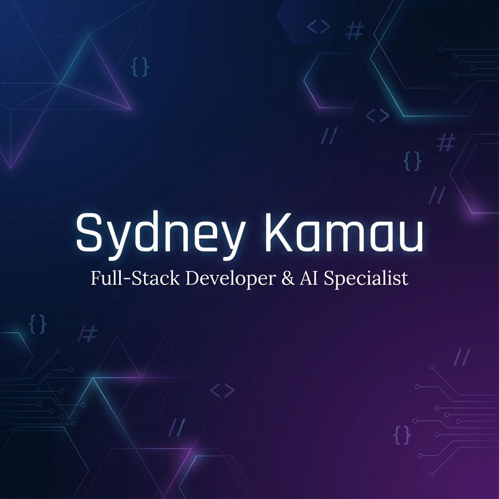

# Sydney Kamau - Portfolio Website

A modern, responsive portfolio website showcasing my work as a Full-Stack Developer & AI Specialist.

🔗 **Live Site**: *Coming Soon*



## ✨ Features

- **Dark/Light Mode** - Toggle between themes with persistent preference
- **Responsive Design** - Optimized for all devices (mobile, tablet, desktop)
- **Animated UI** - Smooth animations powered by Framer Motion
- **Real Projects** - Showcasing actual work with live demos and GitHub links
- **Contact Integration** - Email, Phone, WhatsApp, and Calendly scheduling
- **Certificate Gallery** - Visual display of professional certifications
- **Resume Download** - One-click CV download

## 🛠️ Tech Stack

- **Frontend**: React 18 + TypeScript
- **Styling**: Tailwind CSS + shadcn/ui components
- **Build Tool**: Vite
- **Animations**: Framer Motion
- **Theming**: next-themes
- **Icons**: Lucide React

## 📁 Project Structure

```
sydney-forge-ai/
├── public/
│   ├── certificates/       # Certificate images
│   ├── og-image.png        # Social sharing preview
│   ├── favicon.svg         # SH branded favicon
│   └── SydneyKamauResume.docx
├── src/
│   ├── components/         # Reusable UI components
│   │   ├── ui/             # shadcn/ui components
│   │   ├── Navigation.tsx
│   │   ├── ThemeProvider.tsx
│   │   └── ThemeToggle.tsx
│   ├── pages/              # Route pages
│   │   ├── Home.tsx
│   │   ├── About.tsx
│   │   ├── Skills.tsx
│   │   ├── Projects.tsx
│   │   ├── AIAutomation.tsx
│   │   └── Contact.tsx
│   └── App.tsx
└── index.html
```

## 🚀 Getting Started

### Prerequisites
- Node.js 18+ 
- npm or bun

### Installation

```bash
# Clone the repository
git clone https://github.com/surturn/sydney-forge-ai.git

# Navigate to project
cd sydney-forge-ai

# Install dependencies
npm install

# Start development server
npm run dev
```

The site will be available at `http://localhost:8080`

### Build for Production

```bash
npm run build
npm run preview
```

## 📄 Pages

| Page | Description |
|------|-------------|
| **Home** | Hero section with intro, stats, and specializations |
| **About** | Journey, tech stack, experience, and education |
| **Skills** | Technical skills with progress bars, tools, and certifications |
| **Projects** | Featured projects with live demos and GitHub links |
| **AI & Automation** | AI capabilities and use cases |
| **Contact** | Contact methods, availability, and social links |

## 🎨 Customization

### Theme Colors
Edit `src/index.css` to modify the color scheme. The primary color is teal (`173 80% 40%` in HSL).

### Content
All page content is contained within individual page components in `src/pages/`.

### Certificates
Add certificate images to `public/certificates/` and update the array in `src/pages/Skills.tsx`.

## 📱 Connect

- **GitHub**: [github.com/surturn](https://github.com/surturn)
- **LinkedIn**: [linkedin.com/in/sydney-kamau-991b362a2](https://www.linkedin.com/in/sydney-kamau-991b362a2)
- **Instagram**: [@sydneystechhub](https://www.instagram.com/sydneystechhub)
- **Email**: sydneykamau2005@gmail.com

## 📜 License

This project is open source and available under the [MIT License](LICENSE).

---

Built with ❤️ by Sydney Kamau
